# ClinicFlow - Build Specification & Implementation Plan

> **Version:** 1.1
> **Last Updated:** January 2026
> **Target:** MVP deployment within 2 weeks, followed by feature expansion

---

## Table of Contents

1. [Executive Summary](#1-executive-summary)
2. [Technology Stack Decisions](#2-technology-stack-decisions)
3. [Architecture Overview](#3-architecture-overview)
4. [Database Design](#4-database-design)
5. [User Flow Diagrams](#5-user-flow-diagrams)
6. [MVP Scope (Phase 1)](#6-mvp-scope-phase-1)
7. [Post-MVP Features (Phase 2+)](#7-post-mvp-features-phase-2)
8. [Detailed Implementation Plan](#8-detailed-implementation-plan)
9. [Deployment Strategy](#9-deployment-strategy)
10. [Security & Compliance](#10-security--compliance)
11. [Testing Strategy](#11-testing-strategy)

---

## 1. Executive Summary

### Project Overview

ClinicFlow is a **doctor-centric clinical management platform** designed for solo practitioners or small clinics. The system enables efficient management of:

- Patient records and demographics
- Clinical consultations and visit documentation
- Vital signs tracking (including pediatric parameters)
- Prescription management with reusable templates
- Appointment scheduling

### Current State Analysis

| Component | Status | Completeness |
|-----------|--------|--------------|
| Backend - Accounts | Minimal | 20% |
| Backend - Patients | Good | 70% |
| Backend - Visits | Good | 80% |
| Backend - Prescriptions | Good | 75% |
| Backend - Appointments | Missing | 0% |
| Frontend | Missing | 0% |

### MVP Goal

Deploy a functional clinical management system with:
- User authentication (login/logout)
- Patient CRUD operations
- Visit/consultation documentation
- Vital signs recording
- Basic prescription creation
- Cloud deployment (accessible from any device)

---

## 2. Technology Stack Decisions

### Technology Stack Overview

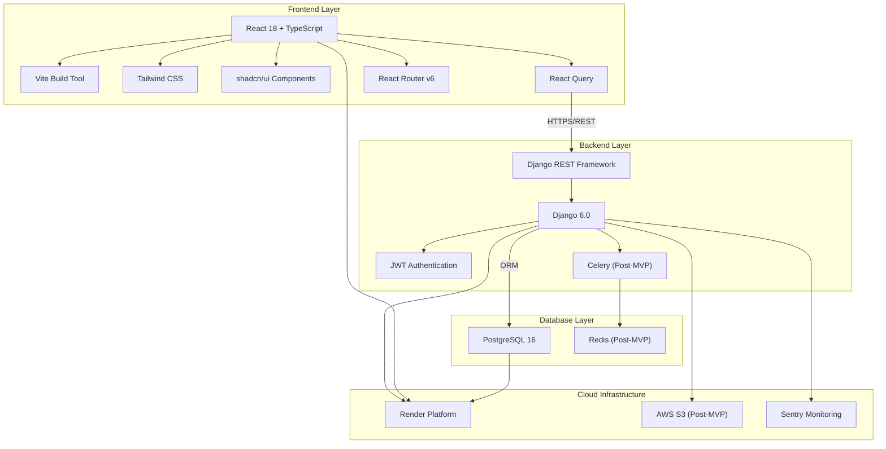

### Frontend Stack

| Technology | Choice | Rationale |
|------------|--------|-----------|
| **Framework** | React 18+ | Industry standard, large ecosystem, excellent for healthcare UIs |
| **Language** | TypeScript | Type safety critical for healthcare data, better tooling |
| **Build Tool** | Vite | Fast development, optimized production builds |
| **UI Library** | shadcn/ui + Tailwind CSS | Modern, accessible (WCAG-compliant), full customization control |
| **State Management** | React Query (TanStack Query) | Server state management, caching, optimistic updates |
| **Routing** | React Router v6 | Standard routing solution, nested routes support |
| **Forms** | React Hook Form + Zod | Performant forms with schema validation |
| **HTTP Client** | Axios | Interceptors for auth, request/response handling |
| **i18n** | react-i18next | Robust internationalization (EN/FR) |
| **Date Handling** | date-fns | Lightweight, tree-shakeable date utilities |
| **Icons** | Lucide React | Clean, consistent icon set |

### Backend Stack

| Technology | Choice | Rationale |
|------------|--------|-----------|
| **Framework** | Django 6.0 | Mature, secure, excellent ORM, admin interface |
| **API** | Django REST Framework 3.16 | Industry standard for Django APIs |
| **Authentication** | JWT (SimpleJWT) | Stateless auth, mobile-ready |
| **Database** | PostgreSQL 16 | ACID compliance, HIPAA-ready, JSON support |
| **Task Queue** | Celery + Redis (Post-MVP) | Background tasks, notifications |
| **PDF Generation** | WeasyPrint | HTML to PDF for prescriptions |
| **CORS** | django-cors-headers | Frontend-backend communication |

### Database Choice: PostgreSQL vs Alternatives

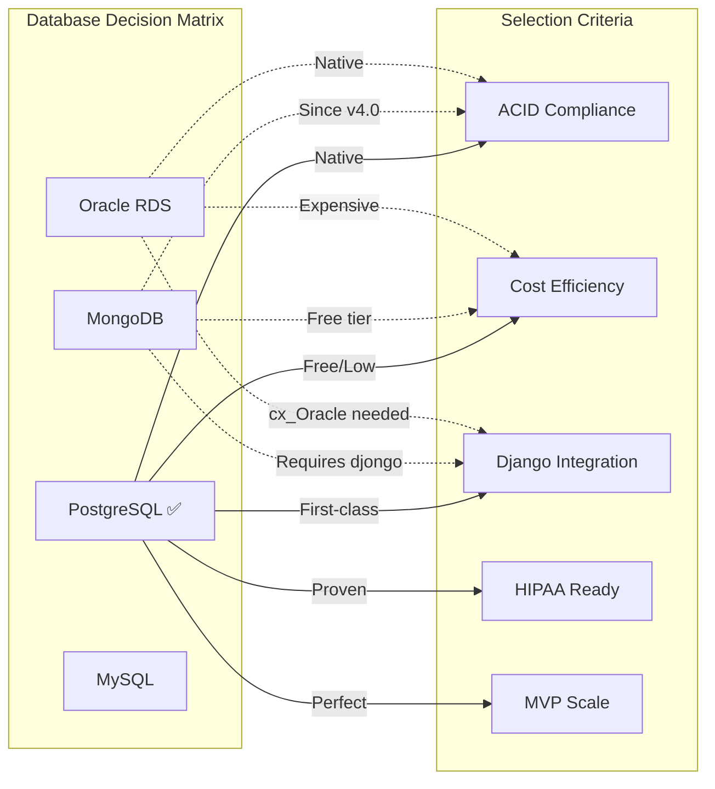

**Why PostgreSQL:**
1. **ACID Compliance** - Native transaction support for data integrity
2. **Regulatory Compliance** - Proven in HIPAA-regulated environments
3. **Cost** - Free, with low-cost cloud options ($7/mo on Render)
4. **Django Integration** - First-class ORM support, no extra drivers
5. **JSON Support** - JSONB for flexible data when needed

### Cloud Deployment Stack

| Service | Choice | Rationale |
|---------|--------|-----------|
| **Platform** | Render | Simple deployment, free tier, PostgreSQL included |
| **Alternative** | Railway | Fast iteration, good developer experience |
| **CDN/Frontend** | Vercel or Render Static | Global CDN, automatic HTTPS |
| **File Storage** | AWS S3 (Post-MVP) | Patient documents, prescription PDFs |
| **Monitoring** | Sentry | Error tracking, performance monitoring |

---

## 3. Architecture Overview

### System Architecture

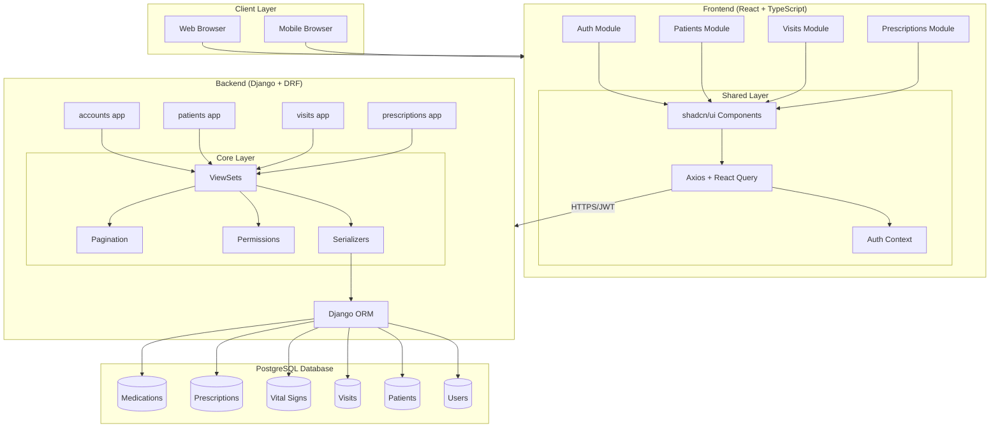

### Frontend Component Architecture

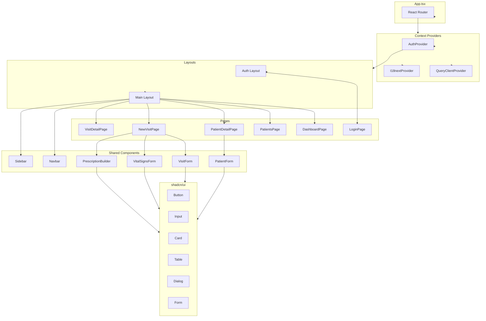

### Backend Module Architecture

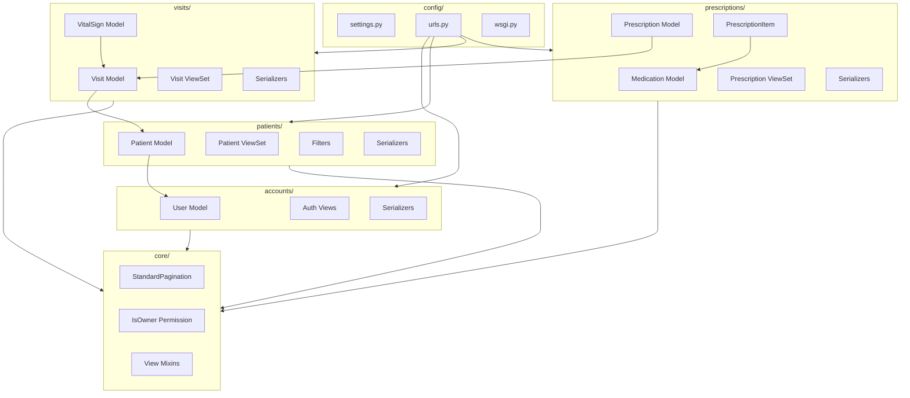

### Frontend Project Structure

```
clinicflow-frontend/
├── public/
│   └── favicon.ico
├── src/
│   ├── api/                    # API client configuration
│   │   ├── client.ts           # Axios instance with interceptors
│   │   ├── auth.ts             # Auth API calls
│   │   ├── patients.ts         # Patient API calls
│   │   ├── visits.ts           # Visit API calls
│   │   └── prescriptions.ts    # Prescription API calls
│   │
│   ├── components/             # Reusable UI components
│   │   ├── ui/                 # shadcn/ui components
│   │   ├── layout/             # Navbar, Sidebar, MainLayout
│   │   ├── patients/           # Patient-specific components
│   │   ├── visits/             # Visit-specific components
│   │   └── prescriptions/      # Prescription components
│   │
│   ├── hooks/                  # Custom React hooks
│   ├── pages/                  # Route components
│   ├── lib/                    # Utility functions
│   ├── i18n/                   # Internationalization
│   ├── types/                  # TypeScript types
│   ├── context/                # React contexts
│   │
│   ├── App.tsx                 # Root component
│   ├── main.tsx                # Entry point
│   └── routes.tsx              # Route definitions
│
├── package.json
├── tsconfig.json
├── tailwind.config.js
└── vite.config.ts
```

### Backend Project Structure

```
clinicflow-backend/
├── config/                     # Project configuration
│   ├── settings/
│   │   ├── base.py
│   │   ├── development.py
│   │   └── production.py
│   ├── urls.py
│   └── wsgi.py
│
├── accounts/                   # User & authentication
├── patients/                   # Patient management
├── visits/                     # Consultations & vitals
├── prescriptions/              # Prescriptions & medications
├── appointments/               # Scheduling (Post-MVP)
├── core/                       # Shared utilities
│
├── requirements/
│   ├── base.txt
│   ├── development.txt
│   └── production.txt
│
├── manage.py
├── Procfile
└── render.yaml
```

---

## 4. Database Design

### Entity Relationship Diagram

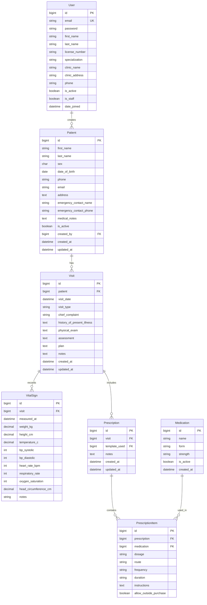

### Data Flow Diagram

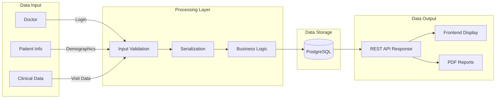

### Model Definitions

#### User Model (Custom)

```python
class User(AbstractBaseUser, PermissionsMixin):
    email = models.EmailField(unique=True)
    first_name = models.CharField(max_length=100)
    last_name = models.CharField(max_length=100)
    license_number = models.CharField(max_length=50, blank=True)
    specialization = models.CharField(max_length=100, blank=True)
    clinic_name = models.CharField(max_length=200, blank=True)
    clinic_address = models.TextField(blank=True)
    phone = models.CharField(max_length=20, blank=True)
    is_active = models.BooleanField(default=True)
    is_staff = models.BooleanField(default=False)
    date_joined = models.DateTimeField(auto_now_add=True)

    USERNAME_FIELD = 'email'
    REQUIRED_FIELDS = ['first_name', 'last_name']
```

#### Patient Model

```python
class Patient(models.Model):
    SEX_CHOICES = [('M', 'Male'), ('F', 'Female')]

    first_name = models.CharField(max_length=100)
    last_name = models.CharField(max_length=100)
    sex = models.CharField(max_length=1, choices=SEX_CHOICES)
    date_of_birth = models.DateField()
    phone = models.CharField(max_length=20, blank=True)
    email = models.EmailField(blank=True)
    address = models.TextField()
    emergency_contact_name = models.CharField(max_length=200, blank=True)
    emergency_contact_phone = models.CharField(max_length=20, blank=True)
    medical_notes = models.TextField(blank=True)
    is_active = models.BooleanField(default=True)
    created_by = models.ForeignKey(User, on_delete=models.PROTECT)
    created_at = models.DateTimeField(auto_now_add=True)
    updated_at = models.DateTimeField(auto_now=True)

    class Meta:
        ordering = ['last_name', 'first_name']
```

#### Visit Model

```python
class Visit(models.Model):
    VISIT_TYPES = [
        ('CONSULTATION', 'Consultation'),
        ('FOLLOW_UP', 'Follow-up'),
        ('EMERGENCY', 'Emergency'),
        ('ROUTINE', 'Routine Check-up'),
    ]

    patient = models.ForeignKey(Patient, on_delete=models.CASCADE, related_name='visits')
    visit_date = models.DateTimeField(default=timezone.now)
    visit_type = models.CharField(max_length=20, choices=VISIT_TYPES)
    chief_complaint = models.CharField(max_length=500, blank=True)
    history_of_present_illness = models.TextField(blank=True)
    physical_exam = models.TextField(blank=True)
    assessment = models.TextField(blank=True)
    plan = models.TextField(blank=True)
    notes = models.TextField(blank=True)
    created_at = models.DateTimeField(auto_now_add=True)
    updated_at = models.DateTimeField(auto_now=True)

    class Meta:
        ordering = ['-visit_date']
```

#### VitalSign Model

```python
class VitalSign(models.Model):
    visit = models.ForeignKey(Visit, on_delete=models.CASCADE, related_name='vital_signs')
    measured_at = models.DateTimeField(default=timezone.now)
    weight_kg = models.DecimalField(max_digits=5, decimal_places=2, null=True, blank=True)
    height_cm = models.DecimalField(max_digits=5, decimal_places=1, null=True, blank=True)
    temperature_c = models.DecimalField(max_digits=4, decimal_places=1, null=True, blank=True)
    bp_systolic = models.PositiveSmallIntegerField(null=True, blank=True)
    bp_diastolic = models.PositiveSmallIntegerField(null=True, blank=True)
    heart_rate_bpm = models.PositiveSmallIntegerField(null=True, blank=True)
    respiratory_rate = models.PositiveSmallIntegerField(null=True, blank=True)
    oxygen_saturation = models.PositiveSmallIntegerField(null=True, blank=True)
    head_circumference_cm = models.DecimalField(max_digits=4, decimal_places=1, null=True, blank=True)
    notes = models.CharField(max_length=500, blank=True)
```

---

## 5. User Flow Diagrams

### Authentication Flow

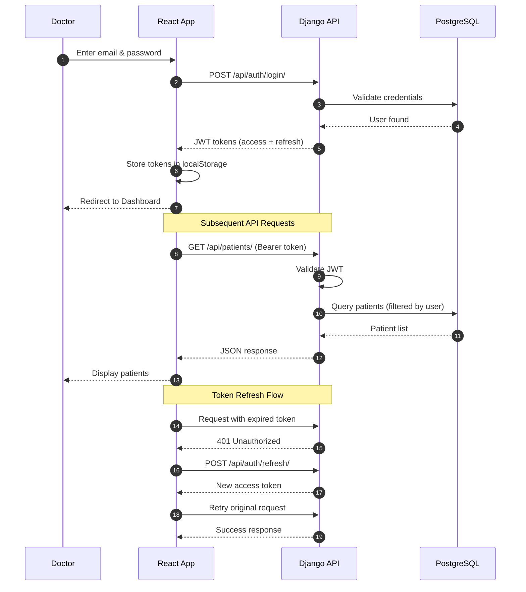

### Patient Registration Flow

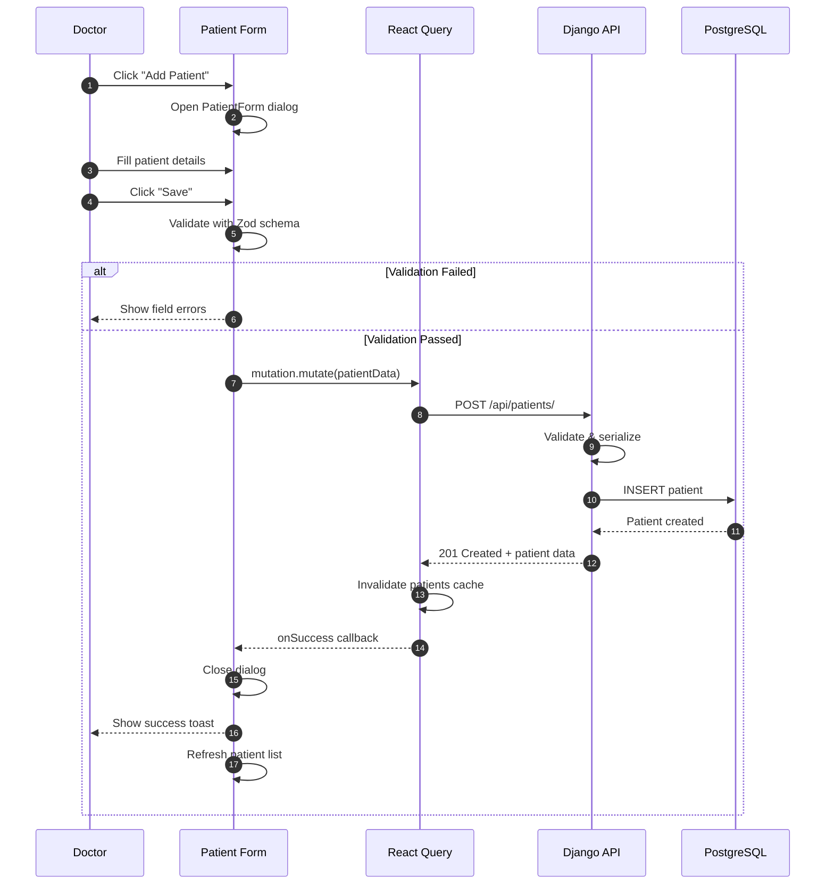

### Clinical Visit Flow

```mermaid
flowchart TB
    Start([Patient Arrives]) --> SelectPatient[Select Patient from List]
    SelectPatient --> NewVisit[Click 'New Visit']
    NewVisit --> VisitType{Select Visit Type}

    VisitType -->|Consultation| ChiefComplaint[Enter Chief Complaint]
    VisitType -->|Follow-up| ChiefComplaint
    VisitType -->|Emergency| ChiefComplaint
    VisitType -->|Routine| ChiefComplaint

    ChiefComplaint --> RecordVitals[Record Vital Signs]

    subgraph Vitals["Vital Signs Recording"]
        RecordVitals --> Weight[Weight]
        RecordVitals --> Height[Height]
        RecordVitals --> Temp[Temperature]
        RecordVitals --> BP[Blood Pressure]
        RecordVitals --> HR[Heart Rate]
        RecordVitals --> O2[Oxygen Saturation]
    end

    Weight --> Clinical
    Height --> Clinical
    Temp --> Clinical
    BP --> Clinical
    HR --> Clinical
    O2 --> Clinical

    subgraph Clinical["Clinical Documentation (SOAP)"]
        History[History of Present Illness]
        Exam[Physical Examination]
        Assessment[Assessment/Diagnosis]
        Plan[Treatment Plan]
    end

    Clinical --> NeedsPrescription{Needs Prescription?}

    NeedsPrescription -->|Yes| Prescription[Create Prescription]
    NeedsPrescription -->|No| SaveVisit

    subgraph Prescription["Prescription Builder"]
        Prescription --> SearchMed[Search Medication]
        SearchMed --> AddMed[Add to Prescription]
        AddMed --> Dosage[Set Dosage & Frequency]
        Dosage --> MoreMeds{More Medications?}
        MoreMeds -->|Yes| SearchMed
        MoreMeds -->|No| SavePrescription[Save Prescription]
    end

    SavePrescription --> SaveVisit[Save Visit]
    SaveVisit --> Complete([Visit Complete])
```

### Prescription Creation Flow

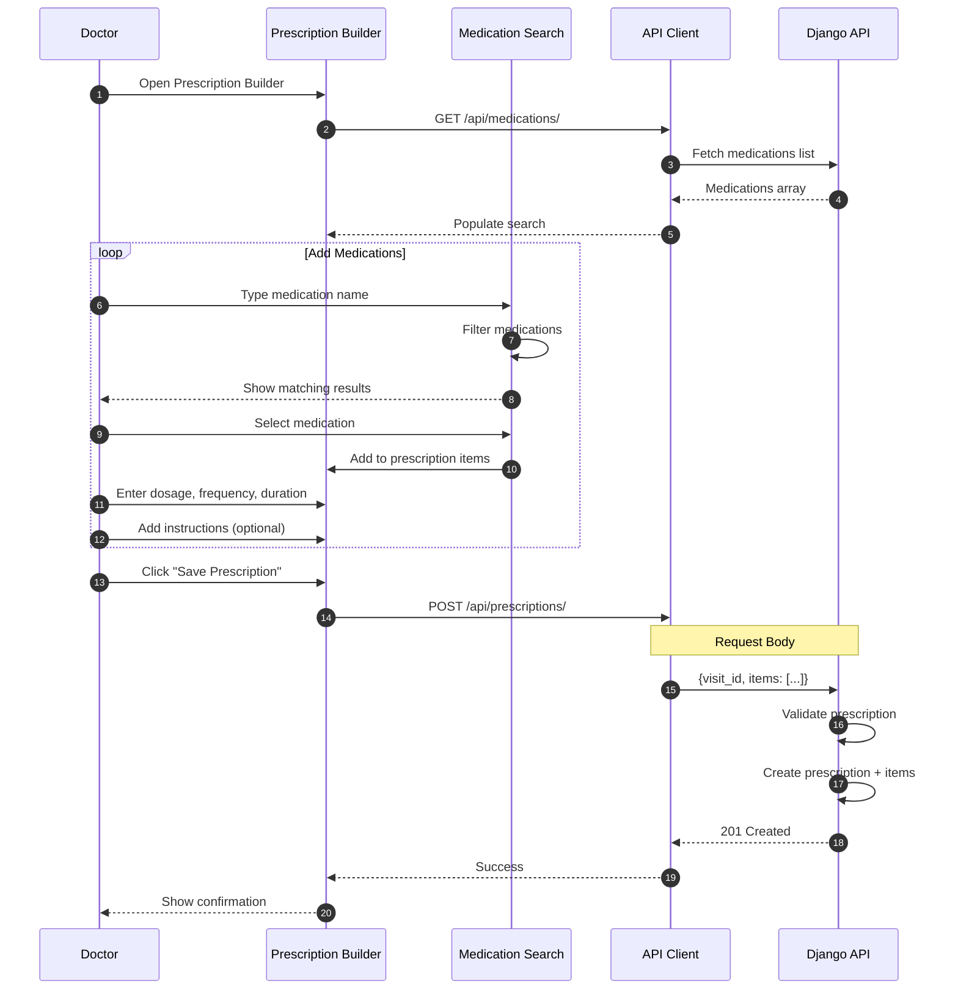

### Complete Clinical Workflow

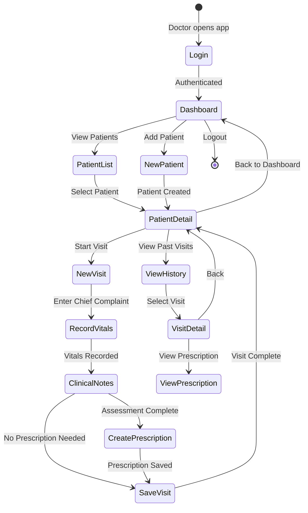

### API Request/Response Flow

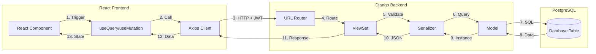

---

## 6. MVP Scope (Phase 1)

### MVP Features Checklist

#### Authentication & User Management
- [x] JWT-based login/logout
- [x] Token refresh mechanism
- [ ] Custom User model with doctor fields
- [ ] Profile view/update
- [ ] Password change

#### Patient Management
- [x] Create new patient
- [x] View patient list
- [x] View patient details
- [x] Update patient information
- [x] Deactivate patient (soft delete)
- [ ] Patient search by name
- [ ] Pagination

#### Visit/Consultation Management
- [x] Create new visit
- [x] Record visit details (complaint, history, exam, assessment, plan)
- [x] View visit history per patient
- [ ] Edit existing visit
- [ ] Visit filtering by date

#### Vital Signs
- [x] Record vital signs during visit
- [x] View vital signs history
- [ ] Multiple vital readings per visit
- [ ] Basic validation (value ranges)

#### Prescriptions
- [x] Create prescription
- [x] Add medication items
- [x] View prescription history
- [ ] Medication search/autocomplete
- [ ] Edit prescription (same day only)

#### Frontend (Complete Build Required)
- [ ] Login page
- [ ] Dashboard with quick stats
- [ ] Patient list with search
- [ ] Patient detail view
- [ ] New visit form
- [ ] Visit detail view
- [ ] Prescription builder
- [ ] Responsive design (mobile-friendly)
- [ ] Basic i18n (EN/FR)

### MVP Exclusions (Deferred to Phase 2)

- Appointment scheduling
- Prescription PDF generation
- Prescription templates management
- Email/SMS notifications
- Document attachments
- Multi-user/multi-clinic support
- Advanced analytics/reports
- Offline capability
- Mobile app

---

## 7. Post-MVP Features (Phase 2+)

### Feature Roadmap

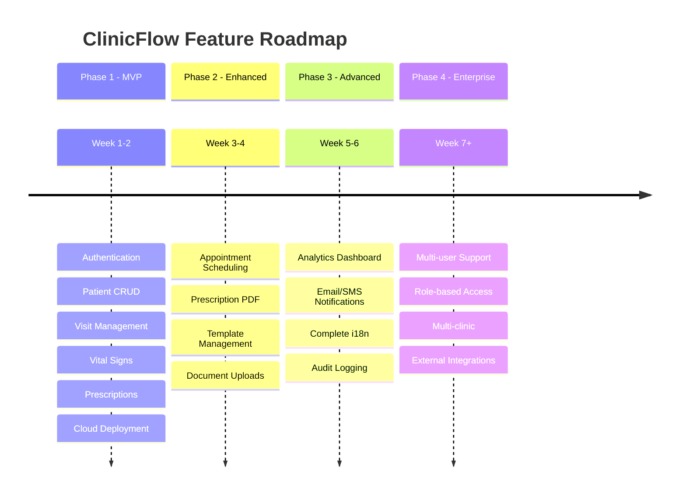

### Phase 2: Enhanced Clinical Workflow

1. **Appointment Scheduling**
   - Calendar view (day/week/month)
   - Time slot management
   - Appointment status tracking
   - Patient appointment history

2. **Prescription Enhancements**
   - PDF generation with clinic letterhead
   - Template management (CRUD)
   - Medication database expansion
   - Dosage calculator helpers

3. **Document Management**
   - File uploads (lab results, scans)
   - AWS S3 integration
   - Document categorization

### Phase 3: Advanced Features

1. **Analytics & Reporting**
   - Patient demographics dashboard
   - Visit statistics
   - Revenue tracking (optional)
   - Export to Excel/CSV

2. **Notifications**
   - Appointment reminders (email/SMS)
   - Follow-up reminders
   - Celery task queue integration

3. **Multi-language Expansion**
   - Complete FR translation
   - Additional languages as needed

### Phase 4: Scale & Enterprise

1. **Multi-user Support**
   - Staff accounts (nurse, receptionist)
   - Role-based access control
   - Audit logging

2. **Multi-clinic Support**
   - Clinic/practice management
   - Data isolation per clinic

3. **Integrations**
   - Laboratory systems
   - Pharmacy systems
   - Insurance providers

---

## 8. Detailed Implementation Plan

### Implementation Timeline

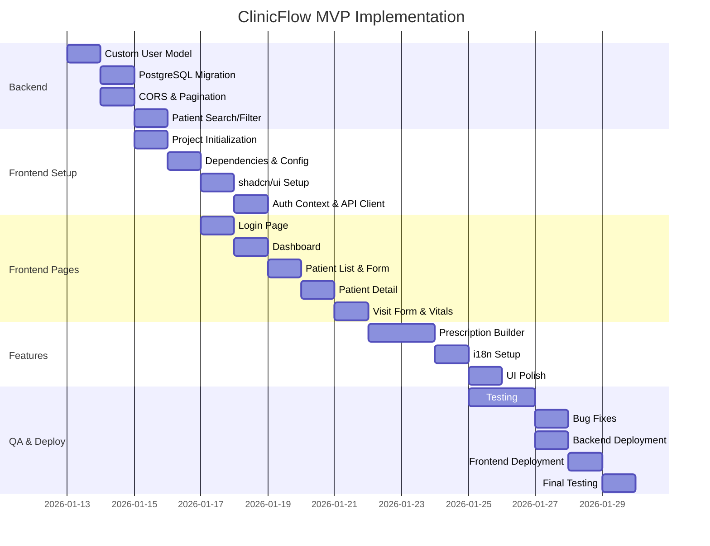

### Week 1: Foundation & Core Backend

#### Days 1-2: Backend Setup & User Model

**Tasks:**
1. Create custom User model with doctor-specific fields
2. Database migration to PostgreSQL
3. Add CORS configuration
4. Implement pagination
5. Add patient search/filtering

**Deliverables:**
- Custom User model with migrations
- PostgreSQL database configured
- CORS enabled
- Paginated API responses
- Patient search functionality

#### Days 3-4: Frontend Foundation

**Tasks:**
1. Initialize React + TypeScript + Vite project
2. Install and configure dependencies
3. Set up project structure
4. Implement authentication layer
5. Create base layout

**Deliverables:**
- Fully configured React project
- Authentication flow working
- Base layout components
- API client configured

#### Days 5-7: Core Frontend Pages

**Tasks:**
1. Dashboard page
2. Patient management (list, detail, form)
3. Visit management (new visit, detail)
4. Vital signs form component

**Deliverables:**
- Functional dashboard
- Complete patient CRUD UI
- Visit creation and viewing
- Vital signs recording

### Week 2: Features & Deployment

#### Days 8-9: Prescriptions & Polish

**Tasks:**
1. Prescription builder
2. Prescription display
3. UI polish (loading, errors, toasts)
4. Internationalization setup

**Deliverables:**
- Working prescription system
- Polished UI with good UX
- Bilingual support

#### Days 10-11: Testing & Bug Fixes

**Tasks:**
1. Backend API tests
2. Frontend component tests
3. Cross-browser testing
4. Bug fixes

**Deliverables:**
- Test suite with good coverage
- Bug-free core functionality
- Responsive design verified

#### Days 12-14: Deployment

**Tasks:**
1. Backend deployment (Render)
2. Frontend deployment (Render/Vercel)
3. Domain & SSL setup
4. Monitoring setup
5. Documentation

**Deliverables:**
- Live production application
- Monitoring configured
- Documentation complete

---

## 9. Deployment Strategy

### Deployment Architecture

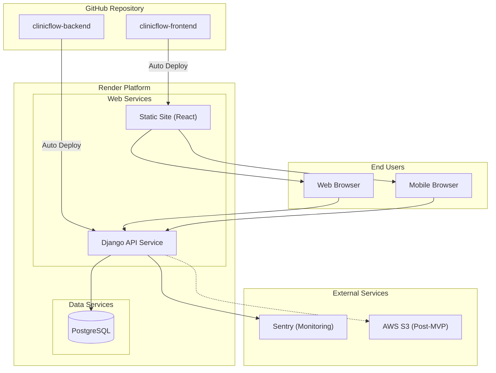

### Render Configuration

#### Backend (render.yaml)

```yaml
services:
  - type: web
    name: clinicflow-api
    env: python
    buildCommand: |
      pip install -r requirements/production.txt
      python manage.py collectstatic --noinput
      python manage.py migrate
    startCommand: gunicorn config.wsgi:application
    envVars:
      - key: DJANGO_SETTINGS_MODULE
        value: config.settings.production
      - key: SECRET_KEY
        generateValue: true
      - key: DATABASE_URL
        fromDatabase:
          name: clinicflow-db
          property: connectionString
      - key: ALLOWED_HOSTS
        value: clinicflow-api.onrender.com
      - key: CORS_ALLOWED_ORIGINS
        value: https://clinicflow.onrender.com

databases:
  - name: clinicflow-db
    plan: free
    databaseName: clinicflow
```

#### Frontend Deployment

```yaml
services:
  - type: static
    name: clinicflow
    buildCommand: npm run build
    staticPublishPath: ./dist
    envVars:
      - key: VITE_API_URL
        value: https://clinicflow-api.onrender.com/api
```

### Environment Variables

#### Backend (.env.production)
```
DJANGO_SETTINGS_MODULE=config.settings.production
SECRET_KEY=<generated>
DATABASE_URL=<postgres-url>
ALLOWED_HOSTS=clinicflow-api.onrender.com
CORS_ALLOWED_ORIGINS=https://clinicflow.onrender.com
DEBUG=False
```

#### Frontend (.env.production)
```
VITE_API_URL=https://clinicflow-api.onrender.com/api
VITE_APP_NAME=ClinicFlow
```

---

## 10. Security & Compliance

### Security Architecture

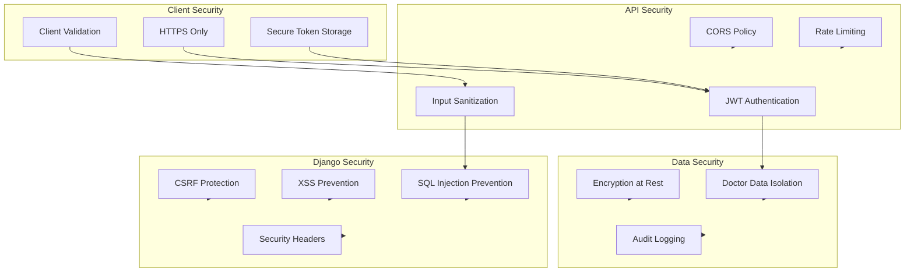

### Security Measures

#### Authentication
- JWT tokens with short expiry (15 minutes access, 7 days refresh)
- Secure HTTP-only cookies for refresh tokens (optional)
- Password hashing with Django's PBKDF2

#### API Security
- All endpoints require authentication (except login)
- HTTPS enforced in production
- CORS properly configured
- Rate limiting on sensitive endpoints

#### Data Protection
- Patient data isolated by doctor (created_by filter)
- No patient data in URLs (use POST for sensitive queries)
- Input validation on all fields
- SQL injection prevention via ORM

#### Django Security Settings
```python
# Production settings
SECURE_BROWSER_XSS_FILTER = True
SECURE_CONTENT_TYPE_NOSNIFF = True
X_FRAME_OPTIONS = 'DENY'
SECURE_SSL_REDIRECT = True
SESSION_COOKIE_SECURE = True
CSRF_COOKIE_SECURE = True
SECURE_HSTS_SECONDS = 31536000
SECURE_HSTS_INCLUDE_SUBDOMAINS = True
```

### HIPAA Considerations (Future)

For full HIPAA compliance (if required in US), additional measures needed:
- Audit logging for all data access
- Data encryption at rest
- Business Associate Agreement with hosting provider
- Regular security assessments
- Data backup and disaster recovery plan

---

## 11. Testing Strategy

### Testing Pyramid

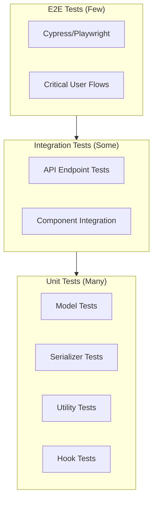

### Backend Testing

```python
# Example test structure
class PatientAPITestCase(APITestCase):
    def setUp(self):
        self.user = User.objects.create_user(
            email='doctor@clinic.com',
            password='testpass123'
        )
        self.client.force_authenticate(user=self.user)

    def test_create_patient(self):
        data = {
            'first_name': 'John',
            'last_name': 'Doe',
            'sex': 'M',
            'date_of_birth': '1990-01-15',
            'address': '123 Main St'
        }
        response = self.client.post('/api/patients/', data)
        self.assertEqual(response.status_code, 201)
        self.assertEqual(Patient.objects.count(), 1)

    def test_patient_isolation(self):
        # Verify doctors can only see their own patients
        other_doctor = User.objects.create_user(
            email='other@clinic.com',
            password='testpass123'
        )
        Patient.objects.create(
            first_name='Jane',
            last_name='Doe',
            sex='F',
            date_of_birth='1985-05-20',
            address='456 Oak Ave',
            created_by=other_doctor
        )
        response = self.client.get('/api/patients/')
        self.assertEqual(len(response.data['results']), 0)
```

### Frontend Testing

```typescript
// Example component test
import { render, screen, fireEvent } from '@testing-library/react';
import { PatientForm } from './PatientForm';

describe('PatientForm', () => {
  it('validates required fields', async () => {
    render(<PatientForm onSubmit={jest.fn()} />);

    fireEvent.click(screen.getByRole('button', { name: /save/i }));

    expect(await screen.findByText(/first name is required/i)).toBeInTheDocument();
    expect(await screen.findByText(/last name is required/i)).toBeInTheDocument();
  });

  it('submits valid data', async () => {
    const onSubmit = jest.fn();
    render(<PatientForm onSubmit={onSubmit} />);

    fireEvent.change(screen.getByLabelText(/first name/i), {
      target: { value: 'John' }
    });
    fireEvent.change(screen.getByLabelText(/last name/i), {
      target: { value: 'Doe' }
    });

    fireEvent.click(screen.getByRole('button', { name: /save/i }));

    expect(onSubmit).toHaveBeenCalledWith(expect.objectContaining({
      first_name: 'John',
      last_name: 'Doe'
    }));
  });
});
```

---

## Appendix A: API Endpoints Reference

### Authentication
| Method | Endpoint | Description |
|--------|----------|-------------|
| POST | /api/auth/login/ | Obtain JWT tokens |
| POST | /api/auth/refresh/ | Refresh access token |
| GET | /api/auth/me/ | Get current user profile |
| PUT | /api/auth/me/ | Update user profile |
| POST | /api/auth/password/change/ | Change password |

### Patients
| Method | Endpoint | Description |
|--------|----------|-------------|
| GET | /api/patients/ | List patients (paginated, searchable) |
| POST | /api/patients/ | Create patient |
| GET | /api/patients/{id}/ | Get patient details |
| PUT | /api/patients/{id}/ | Update patient |
| DELETE | /api/patients/{id}/ | Deactivate patient |

### Visits
| Method | Endpoint | Description |
|--------|----------|-------------|
| GET | /api/visits/ | List visits |
| POST | /api/visits/ | Create visit |
| GET | /api/visits/{id}/ | Get visit details |
| PUT | /api/visits/{id}/ | Update visit |
| GET | /api/patients/{id}/visits/ | Get patient's visits |

### Vital Signs
| Method | Endpoint | Description |
|--------|----------|-------------|
| GET | /api/visits/{id}/vitals/ | Get visit's vital signs |
| POST | /api/visits/{id}/vitals/ | Add vital signs |
| PUT | /api/vitals/{id}/ | Update vital signs |

### Prescriptions
| Method | Endpoint | Description |
|--------|----------|-------------|
| GET | /api/medications/ | List medications |
| GET | /api/prescriptions/ | List prescriptions |
| POST | /api/prescriptions/ | Create prescription |
| GET | /api/prescriptions/{id}/ | Get prescription details |
| PUT | /api/prescriptions/{id}/ | Update prescription |

---

## Appendix B: UI Component Library

### Core Components (shadcn/ui)

| Component | Usage |
|-----------|-------|
| Button | Primary actions, form submissions |
| Input | Text inputs, search fields |
| Select | Dropdowns (sex, visit type) |
| Textarea | Clinical notes, descriptions |
| Card | Patient cards, stat cards |
| Table | Patient lists, visit history |
| Dialog | Forms, confirmations |
| Tabs | Patient detail sections |
| Badge | Status indicators |
| Toast | Success/error notifications |
| Calendar | Date picking |
| Command | Medication search/autocomplete |

---

## Appendix C: Research Sources

### Clinical Software Benchmarks
- [EHR Software Comparison](https://www.ehrinpractice.com/ehr-product-comparison.html)
- [Top EMR Software Systems](https://www.sprypt.com/blog/top-10-electronic-medical-records-software-systems)
- [Best EHR Software 2025](https://neklo.com/blog/best-ehr-software)

### Technology Stack References
- [React Tech Stack 2025](https://www.robinwieruch.de/react-tech-stack/)
- [Healthcare Technology Stack](https://www.aalpha.net/blog/healthcare-technology-stack/)
- [HealthTech MVP Tech Stack](https://www.themomentum.ai/blog/choosing-the-right-tech-stack-for-your-healthtech-mvp)

### Database Selection
- [PostgreSQL vs MongoDB 2025](https://xenoss.io/blog/postgresql-mongodb-comparison)
- [MongoDB vs PostgreSQL Comparison](https://www.sevensquaretech.com/mongodb-vs-postgresql/)

### Deployment Platforms
- [Railway vs Render 2025](https://northflank.com/blog/railway-vs-render)
- [Django Hosting Options](https://learndjango.com/tutorials/django-hosting-deployment-options)

### UI Libraries
- [React UI Libraries 2025](https://blog.croct.com/post/best-react-ui-component-libraries)
- [shadcn/ui Documentation](https://www.shadcn.io/)
- [Material UI vs shadcn](https://codeparrot.ai/blogs/material-ui-vs-shadcn)

---

*This specification serves as the guiding document for ClinicFlow development. Updates should be tracked with version numbers and change dates.*
